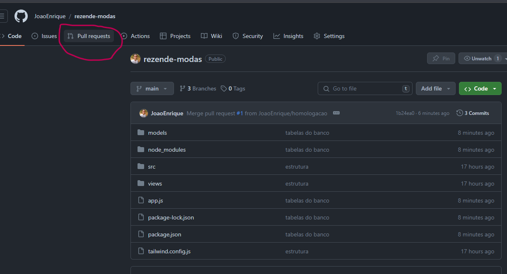

# Rezendes moda

# Para usar

```cmd
git clone https://github.com/JoaoEnrique/rezende-modas.git
cd rezende-modas
```


# Ao terminar modificacoes

se ja tiver com uma branch com seu nome use 
```cmd
git add .
git commit -m "commit"
git push origin seu-nome
```

se nao tiver uma branch, use
```cmd
git branch -M seu-nome
git add .
git commit -m "commit"
git push origin seu-nome
```

Se tiver finalizado uma funcionalidade inteira, tranfira as alteracoes para a branch de homologação com pull request

