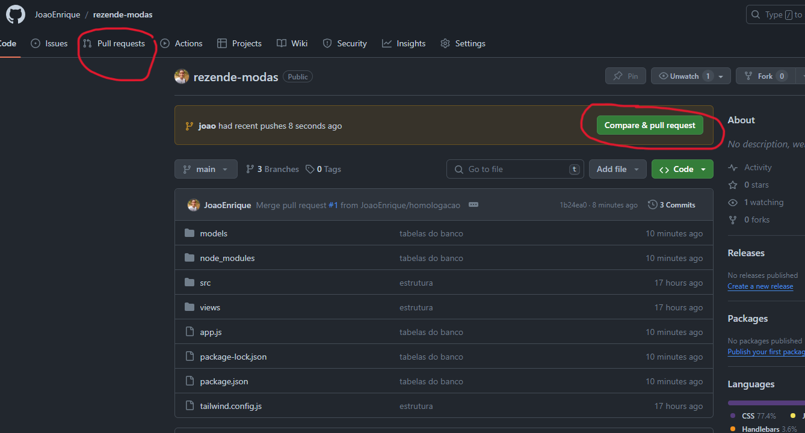

# Rezendes moda
link: https://rezendes-modas.onrender.com/ <br>
OBS: o link pega os arquivos da branch main.

# Para usar

```cmd
git clone https://github.com/JoaoEnrique/rezende-modas.git
cd rezende-modas
```


# Ao terminar modificacoes

se ja tiver com uma branch com seu nome use 
```cmd
git add .
git commit -m "commit"
git push origin seu-nome
```

se nao tiver uma branch, use
```cmd
git branch -M seu-nome
git add .
git commit -m "commit"
git push origin seu-nome
```

# Pull request
Se tiver finalizado uma funcionalidade inteira, tranfira as alteracoes para a branch de homologação com pull request.<br><br>
OBS: apenas o QA transfere da homologação para main

Clique em "pull request" no menu ou em Compare & pull request


Clique em New "pull request" ou em "Compara & pull reques"


Selecione primeiro a branch "homologação" e depois a com o seu nome


Clique no botao "create pull request"


Clique no botao "merge pull request"


Pronto! Agora você fez um pull request e suas alterações foram enviadas para a homologação
